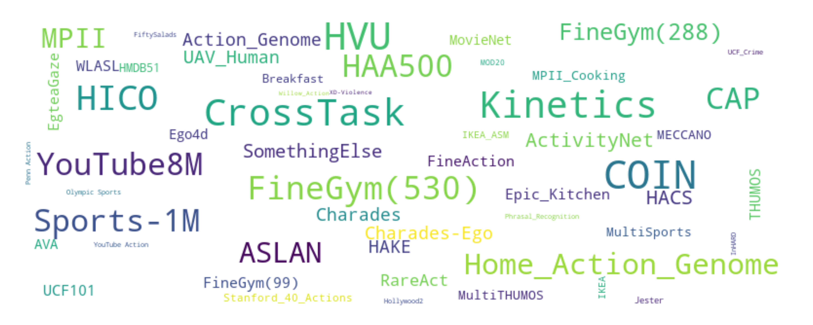

# Semantic Alignment

To construct a shared semantic space for various datasets, semantic consistency should be maintained. The class definitions of datasets are various, but they can be mapped to our semantic space with the fewest semantic damages. 

You can use semantic alignment not only for collected activities but also for any new activities you are interested in :)

    

## Query Our Collected Activities
We provide the annotated results for batch 1/2/3/4 (...more coming) data.
You can query our collected activities via [query_collected.ipynb](./semantic_alignment/query_collected.ipynb).

## Query New Activities
### Utilize Collected Knowledge
With the collected activities and their mapping, you can query new activities via their semantic correlation with the collected ones.

The script is given in [query_new.ipynb](./semantic_alignment/query_new.ipynb).

### Utilize LLM Knowledge
With the recent progress of LLM, automatic semantic alignment can be established via LLM querying. We provide the script in [align_with_clip+gpt.py](./semantic_alignment/align_with_clip+gpt.py) and some results for batch4 data in [dataset_labels_align_result](./semantic_alignment/dataset_labels_align_result).

## Aligned Dataset Statistic
Currently, we have aligned **10642** action labels over **52** datasets.

    

| Dataset             | Action Classes  | Collected | Aligned  |
|---------------------|-----------------|-----------|----------|
| Willow Action       | 7               | ✅        | ✅        |
| Phrasal Recognition | 10              | ✅         | ✅        |
| Stanford 40 Actions | 40              | ✅         | ✅        |
| MPII                | 410             | ✅         | ✅        |
| HICO                | 600             | ✅         | ✅        |
| HAKE                | 156             | ✅         | ✅        |
| HMDB51              | 51              | ✅         | ✅        |
| HAA500              | 500             | ✅         | ✅        |
| AVA                 | 80              | ✅         | ✅        |
| YouTube Action      | 11              | ✅         | ✅        |
| ASLAN               | 432             | ✅         | ✅        |
| UCF101              | 101             | ✅         | ✅        |
| Olympic Sports      | 16              | ✅         | ✅        |
| Penn Action         | 15              | ✅         | ✅        |
| Charades            | 157             | ✅         | ✅        |
| Charades-Ego        | 157             | ✅         | ✅        |
| ActivityNet         | 200             | ✅         | ✅        |
| HACS                | 200             | ✅         | ✅        |
| Home Action Genome  | 453             | ✅         | ✅        |
| Kinetics      | 700            | ✅         | ✅        |
| MOD20         | 20             | ✅         | ✅        |
| IKEA_ASM      | 33             | ✅         | ✅        |
| FineAction    | 106            | ✅         | ✅        |
| CAP           | 459            | ✅         | ✅        |
| CrossTask     | 704            | ✅         | ✅        |
| FineGym(530)  | 530            | ✅         | ✅        |
| FineGym(99)   | 99             | ✅         | ✅        |
| UCF_Crime     | 13             | ✅         | ✅        |
| XD-Violence   | 6              | ✅         | ✅        |
| FineGym(288)  | 288            | ✅         | ✅        |
| YouTube8M     | 493            | ✅         | ✅        |
| Sports-1M     | 487            | ✅         | ✅        |
| THUMOS        | 101            | ✅         | ✅        |
| Action_Genome | 157            | ✅         | ✅        |
| MultiTHUMOS   | 65             | ✅         | ✅        |
| HVU           | 739            | ✅         | ✅        |
| RareAct       | 136            | ✅         | ✅        |
| COIN          | 778            | ✅         | ✅        |
| Hollywood2    | 12             | ✅         | ✅        |
| MovieNet      | 80             | ✅         | ✅        |
| MultiSports   | 66             | ✅         | ✅        |
| InHARD        | 14             | ✅         |  ⬜     |
| Jester        | 27             | ✅         |  ⬜     |
| MECCANO       | 61             | ✅         |  ⬜     |
| MPII_Cooking  | 65             | ✅         |  ⬜     |
| UAV_Human     | 155            | ✅         |  ⬜     |
| WLASL         | 100            | ✅         |  ⬜     |
| Breakfast     | 49             | ✅         |  ⬜     |
| Ego4d         | 77             | ✅         |  ⬜     |
| EgteaGaze     | 106            | ✅         |  ⬜     |
| Epic_Kitchen  | 97             | ✅         |  ⬜     |
| FiftySalads   | 17             | ✅         |  ⬜     |
| IKEA          | 32             | ✅         |  ⬜     |
| SomethingElse | 174            | ✅         |  ⬜     |
